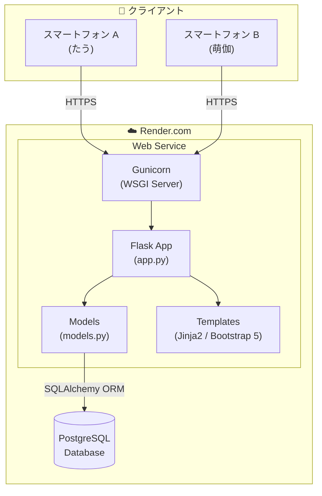
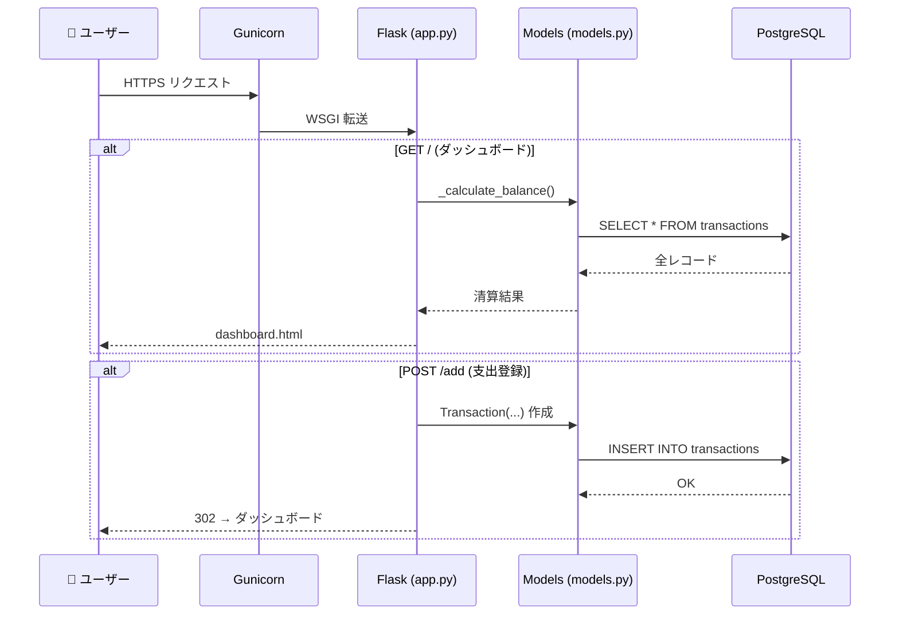
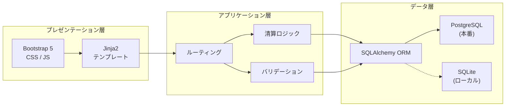

# アーキテクチャ図 — カップル家計簿

## システム全体構成



## リクエストフロー



## レイヤー構成



## ファイル構成マップ

```
household_app/
├── app/
│   ├── __init__.py          ← パッケージ初期化
│   ├── app.py               ← Flask ルーティング・清算ロジック
│   ├── models.py            ← SQLAlchemy モデル・定数
│   ├── templates/
│   │   ├── base.html        ← 共通レイアウト (Bootstrap 5)
│   │   ├── dashboard.html   ← ダッシュボード
│   │   ├── add_transaction.html  ← 支出登録
│   │   ├── edit_transaction.html ← 支出編集
│   │   └── history.html     ← 履歴一覧
│   └── static/
│       ├── css/style.css    ← カスタムスタイル
│       └── js/main.js       ← フロントエンドJS
├── requirements.txt
├── Procfile
└── DOCS_*.md
```

## 環境別 DB 切り替え

| 環境 | DATABASE_URL 環境変数 | 使用 DB |
|------|----------------------|---------|
| ローカル開発 | 未設定 | SQLite (`instance/household.db`) |
| Render.com 本番 | 設定済み | PostgreSQL |
